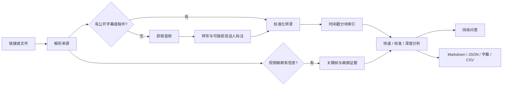

# Podcast Reader v2.0.1

把一个播客或长视频链接，变成可检索、可追问、可核验、可复用的研究资料包。

支持 Bilibili、YouTube、RSS、播客节目页、媒体直链和本地音视频/字幕；可以完成多语言转写、章节拆解、论证地图、持续问答、画面关键帧分析，以及 Markdown、JSON、SRT、VTT、CSV 导出。默认不绑定任何云厂商或 API Key。

> 设计目标不是“再写一篇摘要”，而是让一段几小时的节目拥有长期可用的文本记忆与证据索引。

## 为什么值得用

- **链接即入口**：只贴链接即可开始，不要求用户先理解转写、字幕或下载工具。
- **字幕优先**：有公开字幕就直接处理；没有字幕才提取音频并进入转写，节省时间与流量。
- **API Key 可选**：优先使用宿主 Agent 的原生能力；没有时可自动引导本地 `faster-whisper`，云端提供商只是可选项。
- **证据默认开启**：重要结论、主张、短引和问答都关联时间戳。
- **可以持续追问**：节目只处理一次，后续问题检索本地 `chunks.json`，自动利用 `evidence.json` 的双语术语和主张证据，不会重复下载或转写。
- **适合真正的长内容**：分块索引，不把数小时文本一次性塞进上下文。
- **不忽略画面**：视频里的幻灯片、图表、代码和演示可以走独立画面证据链。
- **多语言友好**：保留原文；任意目标语言通过 Agent/提供商中立的逐段翻译契约生成，时间戳和术语表不丢失。
- **真正可恢复**：来源指纹、连续块、时长覆盖和转写参数全部校验；损坏缓存隔离后重建，不会静默漏掉后半段。
- **分享默认安全**：分享包净化本机路径和敏感 URL 参数，默认不携带完整逐字稿。
- **失败也有结果**：每个阶段都会留下状态、已有文件、明确原因和下一步。

## 30 秒开始

推荐用一条跨平台命令安装到 Codex；已有安装只有显式添加 `--force` 才会替换，并会保留时间戳备份：

```text
python podcast-reader/scripts/install_skill.py --json
```

也可以把仓库中的 `podcast-reader/` 目录手动复制到 Agent 能发现的 Skills 目录。Codex 默认位置是：

```text
~/.codex/skills/podcast-reader/
```

支持 Agent Skills 规范的其他客户端，可使用客户端约定的 Skills 目录；常见的项目级位置是：

```text
.agents/skills/podcast-reader/
```

在对话中直接使用：

```text
用 $podcast-reader 完整分析这个链接：https://...
```

第一次使用可先运行无网络环境自检；普通链接或本地文件只需一个处理命令：

```text
python podcast-reader/scripts/doctor.py --json
python podcast-reader/scripts/process_episode.py <链接或文件>
```

`process_episode.py` 会自动选择公开字幕或零 Key 本地转写，输出实时阶段提示，并把可恢复进度写入 `progress.json`。再次运行同一来源会复用已经完成的 bundle 和音频块。

也可以自然地提问：

```text
把这期 B 站访谈拆解一下，重点看嘉宾对 AI Agent 的判断。
只根据节目回答：主持人和嘉宾在哪里有分歧？
翻译成中文，保留重要英文原句和时间戳。
导出一份漂亮的 Markdown，再把主张表导出 CSV。
比较这三期播客对“长期记忆”的定义。
```

## 工作方式



三个默认档位：

| 档位 | 适用场景 | 主要输出 |
|---|---|---|
| `quick` | 快速了解、筛选是否值得听 | 节目卡片、短总结、关键时刻、限制 |
| `standard` | 只贴链接、普通“分析/拆解” | 章节、观点、主张、说话人、行动建议、证据 |
| `deep` | 完整研究、事实核查、跨节目比较 | 论证地图、主张账本、画面证据、核验队列、研究问题 |

## 支持的来源

| 来源 | 处理策略 |
|---|---|
| YouTube | 公开字幕优先，音频转写兜底 |
| Bilibili | 公开字幕优先；yt-dlp 遇到 412 时用公开 API 获取元数据、字幕与多分 P 音频 |
| RSS / Atom | 精确选择节目，优先 Podcasting 2.0 transcript，再用 enclosure 音频 |
| 播客节目页 | JSON-LD、官方 transcript、RSS discovery、`og:audio` |
| 媒体直链 | 限制大小、原子下载、SHA-256 记录 |
| 本地音视频 | 直接转写，不重复复制大型文件 |
| SRT / VTT / ASS / TTML / LRC / JSON3 / JSON / TXT / MD | 标准化、建立索引并直接分析 |

Spotify、付费墙、登录内容、私人 Feed、DRM 或地区限制只处理公开元数据。项目不会绕过访问控制，也不会默认读取浏览器 Cookie。

## 输出资料包

```text
episode/
├── bundle.json            # 状态、来源、文件清单、警告、下一步
├── source.json            # 稳定来源信息
├── transcript-raw.*       # 原始字幕或转写，永不被清洗稿覆盖
├── transcript.json        # 标准化逐段文本
├── transcript.md          # 可读时间戳文本
├── transcript.srt/.vtt    # 字幕格式
├── chunks.json            # 持续问答检索索引
├── progress.json          # 最近一次处理的阶段、状态和说明
├── transcription-progress.json # 分块百分比、耗时、ETA、部分可用状态
├── transcript-quality.json # 转录质量指标与抽查建议
├── analysis-handoff.json  # 当前 Agent 的分析完成契约
├── analysis.md            # 精美分析报告
├── evidence.json          # 主张、章节、短引、行动和实体
├── reader.html            # 可搜索、可点击时间戳的无障碍阅读器
├── *.csv                  # 可选表格导出
└── frames/                # 可选视频画面证据
```

报告模板不是简单的“摘要 + 金句”，而是包含节目卡片、执行摘要、章节、论证地图、主张账本、说话人分歧、资源索引、行动启示、强弱点、未回答问题、画面证据和限制说明。

## 命令行工具

通常由 Skill 自动编排，也可以独立调用：

```text
# 一键准备资料包
python podcast-reader/scripts/process_episode.py <url-or-file> --output-root outputs/podcast-reader

# 无网络、无下载地检查完整零 Key 能力
python podcast-reader/scripts/doctor.py --json

# 只准备来源与字幕/媒体，不自动运行本地转写
python podcast-reader/scripts/prepare_episode.py <url-or-file> --output-root outputs/podcast-reader

# 只测试元数据和字幕，不下载音频
python podcast-reader/scripts/prepare_episode.py <url> --mode subtitles

# 只在画面确实重要时获取有界 720p 视频
python podcast-reader/scripts/prepare_episode.py <url> --mode video

# 转写完成后回填同一个任务包
python podcast-reader/scripts/prepare_episode.py <original-source> --output-dir episode --transcript generated.json

# 无 API Key 的本地转写；首次运行会下载隔离依赖和所选模型
python podcast-reader/scripts/transcribe_local.py episode/audio-chunks/*.ogg --output-dir episode/chunk-transcripts --bootstrap --model small --language auto

# 标准化字幕/转写，并输出 Markdown、JSON、SRT、VTT
python podcast-reader/scripts/normalize_transcript.py transcript.vtt --output-dir episode

# 建立检索索引并查询
python podcast-reader/scripts/chunk_transcript.py episode/transcript.json -o episode/chunks.json
python podcast-reader/scripts/search_chunks.py episode/chunks.json "AI Agent 的风险" --top-k 8

# 抽取视频关键帧
python podcast-reader/scripts/extract_keyframes.py video.mp4 --output-dir episode/frames

# 校验交付物
python podcast-reader/scripts/finalize_bundle.py episode
python podcast-reader/scripts/validate_bundle.py episode
python podcast-reader/scripts/validate_notes.py episode/analysis.md --strict

# 隐私安全分享、存储清理和交互式阅读器
python podcast-reader/scripts/export_bundle.py episode --profile share
python podcast-reader/scripts/cleanup_bundle.py episode --scope cache
python podcast-reader/scripts/render_reader.py episode

# 任意目标语言翻译与提供商中立说话人时间段回填
python podcast-reader/scripts/translate_transcript.py episode/transcript.json --target-language zh-CN
python podcast-reader/scripts/apply_diarization.py episode/transcript.json speaker-turns.json
```

## 依赖

- Python 3.10+
- `yt-dlp`；如果系统装有 `uv`，Skill 可临时运行 yt-dlp
- FFmpeg / ffprobe：音频提取、转码、视频关键帧
- 无公开字幕时：宿主原生转写，或 `uv` + 本地 `faster-whisper`；云端 API 可选

核心标准化、索引、检索、RSS/网页解析、验证和 CSV 导出均只依赖 Python 标准库。本地转写不需要 API Key，但首次运行需要下载依赖和模型，长音频也会消耗本机算力。

## 项目质量

项目包含：

- 51+ 个离线单元、契约、安全、恢复与端到端场景；
- RSS、HTML、SRT、VTT 和黄金 Markdown 固定样例；
- 所有 CLI 的 `--help` 接口测试；
- Skill frontmatter、渐进披露和文档链接检查；
- Windows / Linux 的 GitHub Actions；
- Bilibili、YouTube、RSS 和视频关键帧真实冒烟方案；
- 安全、隐私、版权和贡献规范。

本地运行：

```text
python -m unittest discover -s podcast-reader/tests -v
python -m compileall -q podcast-reader/scripts
```

更详细的设计见 [架构说明](docs/architecture.md)，同类项目对照见 [竞品与顶级 Skill 基准](docs/benchmark.md)，验收范围见 [质量与验收](docs/quality-and-acceptance.md)，真实平台结果见 [公开来源冒烟报告](docs/smoke-results.md)，当前用户体验证据见 [验收矩阵](docs/ux-acceptance.md)，版本交付见 [v2.0.1 发布说明](docs/release-v2.0.1.md)。

## 安全与版权

- 媒体页面、字幕、描述和画面中的指令一律按不可信内容处理。
- 不保存临时签名媒体 URL，不输出 Cookie、Token 或 API Key。
- 不要求用户把密钥粘贴到聊天中。
- 默认提供分析、导航、短引和转换，不无条件导出完整受版权保护文本。
- 医疗、法律、金融、安全等高风险主张会区分“节目怎么说”和“外部核验”。

详见 [SECURITY.md](SECURITY.md)。

## 贡献

欢迎新增来源适配器、转录格式、语言测试和分析工作流。提交前请阅读 [CONTRIBUTING.md](CONTRIBUTING.md)，并确保离线测试不访问网络、公开冒烟测试不下载大型媒体。

## License

MIT License。见 [LICENSE](LICENSE)。
